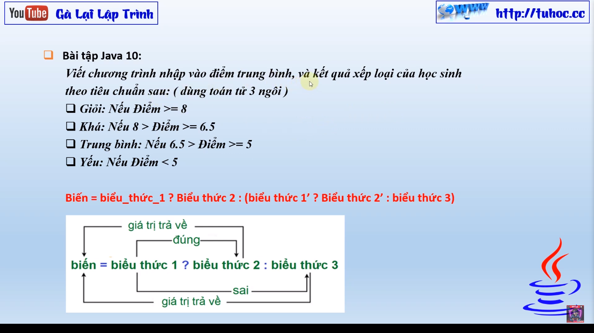

# Bài Giảng: Toán Tử 3 Ngôi trong Java - Bài Tập Java 10 - Seri Tự Học Java 2023

Mình là gà lại lập trình và mình muốn giới thiệu cho các bạn một bài giảng mới trên kênh YouTube của mình: "
Toán tử 3 ngôi trong Java - Bài tập Java 10 - Seri tự học Java 2023". Bài giảng này sẽ hướng dẫn các bạn cách
sử dụng các toán tử 3 ngôi trong ngôn ngữ lập trình Java và cách giải quyết các bài tập Java cơ bản. Đây là
bài giảng đầu tiên trong seri tự học Java của mình, và nó được dành cho những người mới bắt đầu học lập trình.

Bài giảng sẽ giúp các bạn hiểu rõ hơn về cách sử dụng các toán tử 3 ngôi trong Java và cách giải quyết các bài
tập cơ bản nhất. Ngoài ra, mình cũng sẽ chia sẻ với các bạn một số kỹ thuật và triết lý lập trình để giúp các
bạn hiểu rõ hơn về ngôn ngữ Java.

Mong rằng bài giảng này sẽ giúp các bạn có được kiến thức cơ bản về lập trình Java và có thể tiếp cận với ngôn
ngữ này dễ dàng hơn. Hãy đừng ngần ngại để lại những câu hỏi và góp ý trong bình luận, mình sẽ trả lời các bạn
sớm nhất có thể.

Chúc các bạn có một bài học vui vẻ và hiệu quả!

