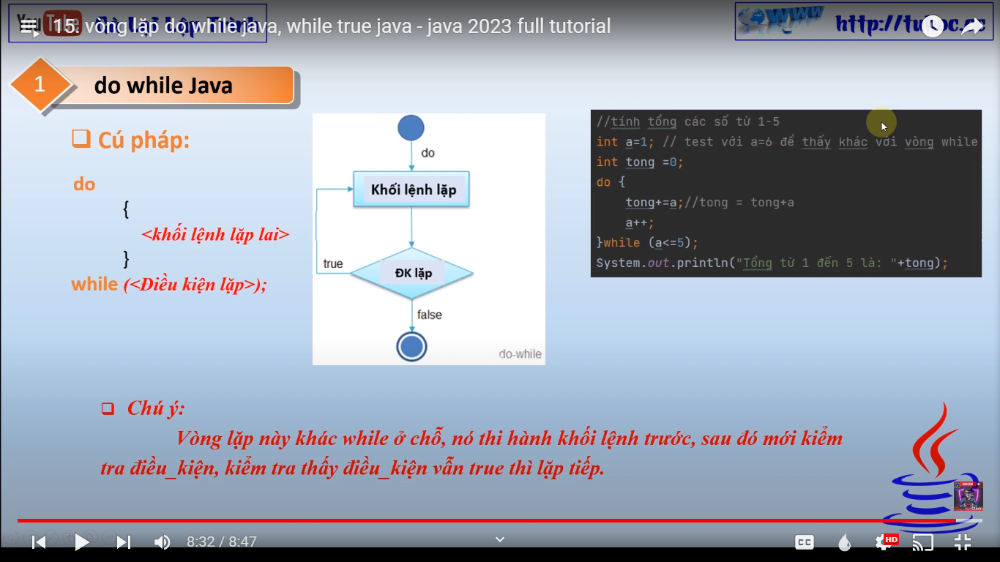
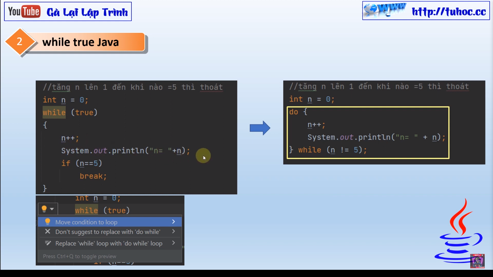

"Xin chào các bạn, chào mừng đến với video mới của kênh của tôi. Trong video này, tôi sẽ hướng dẫn các bạn về
hai loại vòng lặp quan trọng trong lập trình Java: vòng lặp do-while và while true. Tôi sẽ giải thích cách sử
dụng chúng, và cho các bạn biết khi nào nên sử dụng mỗi loại. Hãy cùng theo dõi video để tìm hiểu thêm về cách
lập trình với vòng lặp do-while và while true trong Java."

