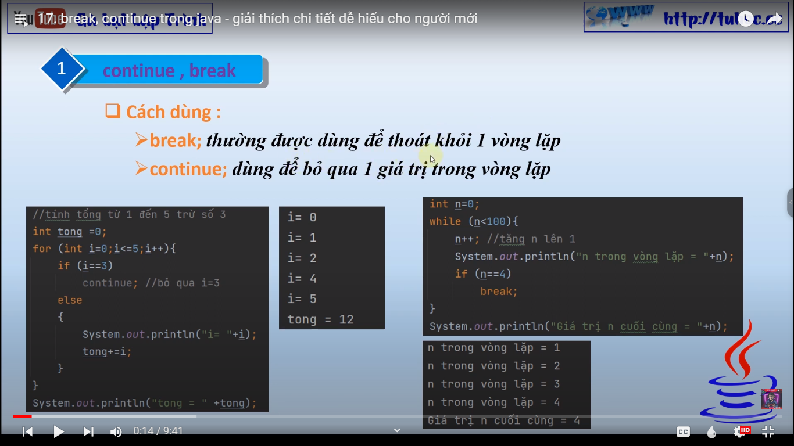
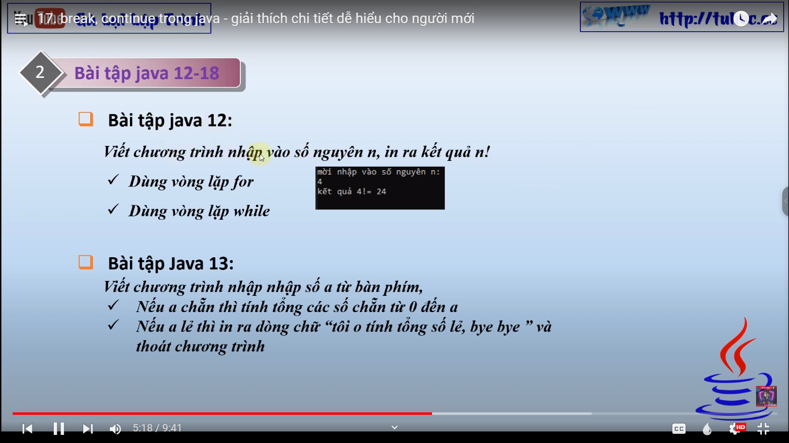
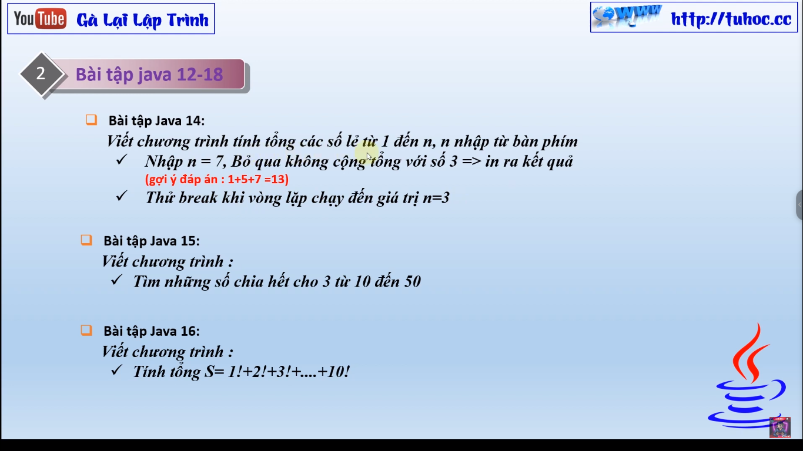
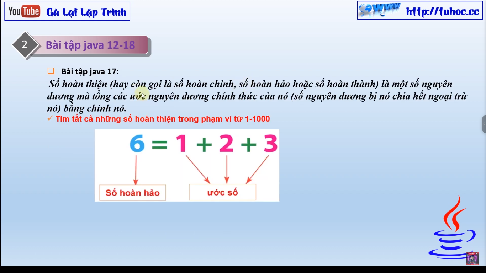
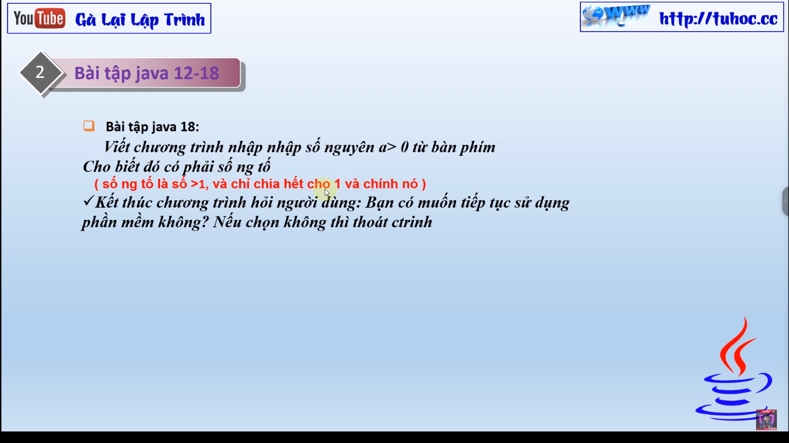

# 17. break, continue trong java - giải thích chi tiết dễ hiểu cho người mới

- "Chào mừng đến với kênh của tôi! Trong video mới này, tôi sẽ giới thiệu với các bạn về hai từ khoá quan
  trọng trong lập trình Java - 'break' và 'continue'. Tôi sẽ giải thích chi tiết cách sử dụng cả hai từ khoá
  này trong vòng lặp, và hướng dẫn các bạn cách sử dụng chúng để tối ưu hóa mã của bạn. Đây là video rất hữu
  ích cho những người mới bắt đầu học lập trình Java, vì 'break' và 'continue' là hai từ khoá quan trọng trong
  việc kiểm soát vòng lặp. Hãy cùng xem video để tìm hiểu thêm về 'break' và 'continue' trong Java nhé!"

- Bài tập rèn luyện từ bài 12 đến bài 18

