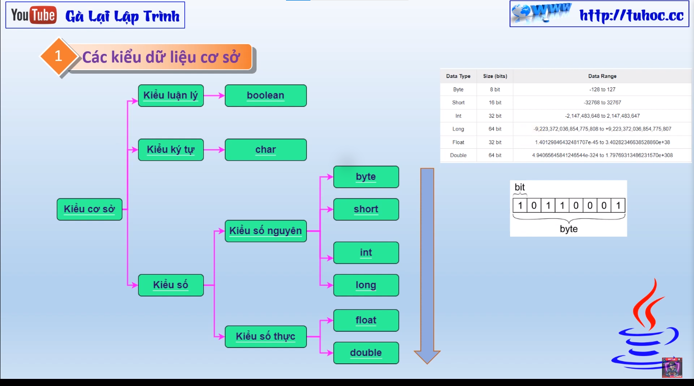

# Ép Kiểu Dữ Liệu Trong Java

Trong Java, việc **ép kiểu dữ liệu** (_type casting_) là quá trình chuyển đổi một biến từ một kiểu dữ liệu sang một kiểu dữ liệu khác. Điều này có thể được thực hiện bằng cách sử dụng các toán tử ép kiểu trong Java.

Có hai loại ép kiểu trong Java: ép kiểu tự nhiên (_implicit type casting_) và ép kiểu bắt buộc (_explicit type casting_).

### Ép Kiểu Tự Nhiên

Ép kiểu tự nhiên xảy ra khi chúng ta chuyển đổi một biến từ một kiểu dữ liệu nhỏ hơn sang một kiểu dữ liệu lớn hơn. Ví dụ, khi chúng ta chuyển đổi một biến kiểu `int` sang một biến kiểu `long`, Java sẽ tự động ép kiểu cho chúng ta.

### Ép Kiểu Bắt Buộc

Ép kiểu bắt buộc xảy ra khi chúng ta chuyển đổi một biến từ một kiểu dữ liệu lớn hơn sang một kiểu dữ liệu nhỏ hơn. Chúng ta cần sử dụng cú pháp sau để ép kiểu bắt buộc trong Java:

```java
(Kiểu_dữ_liệu_mới) biến;
```

Ví dụ, để chuyển đổi một biến kiểu `long` sang một biến kiểu `int`, chúng ta có thể sử dụng cú pháp sau:

```java
long x = 12345678;
int i = (int) x;
```

Trong trường hợp này, biến `x` là một biến kiểu `long` và chúng ta muốn chuyển nó sang kiểu `int`.

Cần lưu ý rằng ép kiểu bắt buộc có thể dẫn đến mất một số dữ liệu khi chúng ta chuyển đổi từ một kiểu dữ liệu có số bit lớn hơn sang một kiểu dữ liệu có số bit nhỏ hơn. Tuy nhiên, ép kiểu tự nhiên luôn an toàn và không mất dữ liệu, vì nó chỉ xảy ra khi chúng ta chuyển đổi từ một kiểu dữ liệu nhỏ hơn sang một kiểu dữ liệu lớn hơn.
