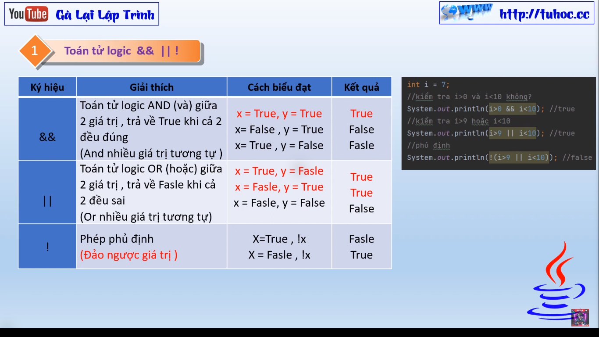
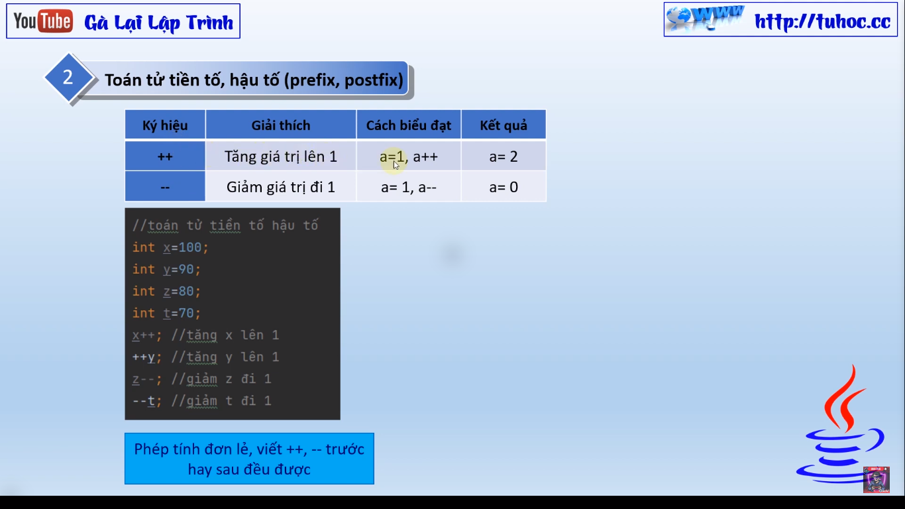
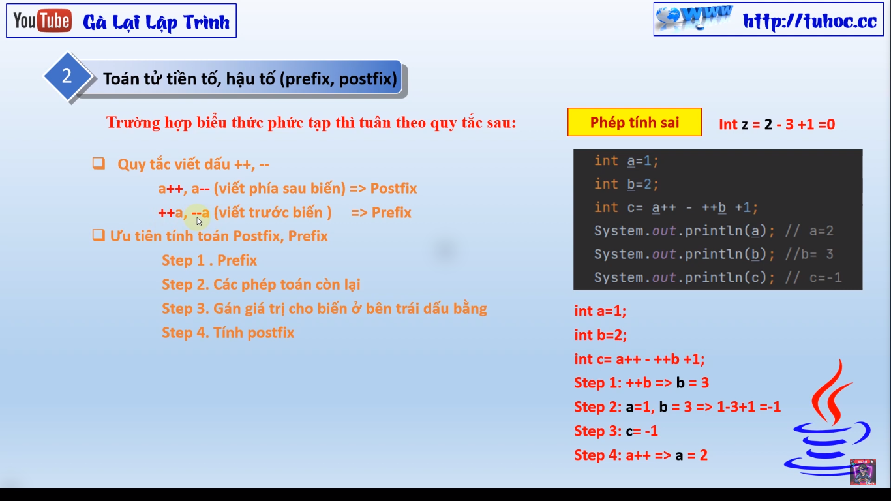

# Bài Giảng về Toán Tử Logic và Toán Tử Tiền Tố/Hậu Tố Trong Java

Trong bài giảng mới của tôi, chúng ta sẽ tìm hiểu về các **toán tử logic** trong ngôn ngữ lập trình Java. Bạn sẽ học cách sử dụng các toán tử AND, OR, NOT và cách sử dụng chúng để xử lý các biểu thức logic trong mã của bạn.

Chúng ta cũng sẽ tìm hiểu về các **toán tử tiền tố và hậu tố**, bao gồm cách chúng được sử dụng trong Java và làm thế nào chúng có thể giúp cho việc viết mã của bạn trở nên hiệu quả hơn.

Cuối cùng, chúng ta sẽ cùng nhau thực hành một số bài tập với các toán tử logic và toán tử tiền tố/hậu tố để áp dụng những kiến thức mà chúng ta đã học được.

Tôi hy vọng rằng qua bài giảng này, các bạn sẽ có thể hiểu rõ hơn về các toán tử logic và toán tử tiền tố/hậu tố trong Java và có thể sử dụng chúng một cách hiệu quả trong việc viết mã của mình.
