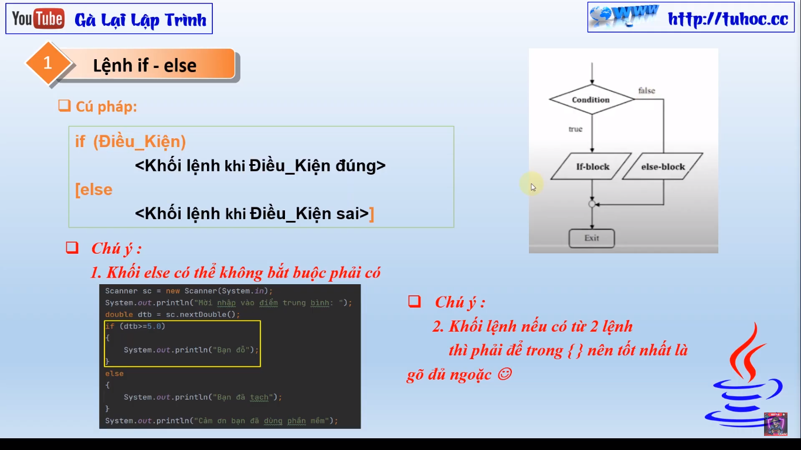
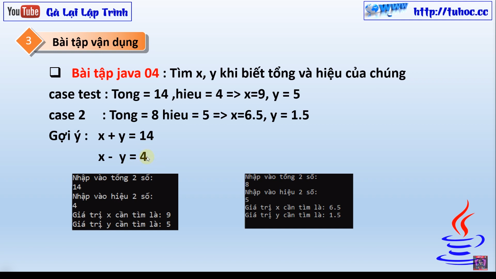
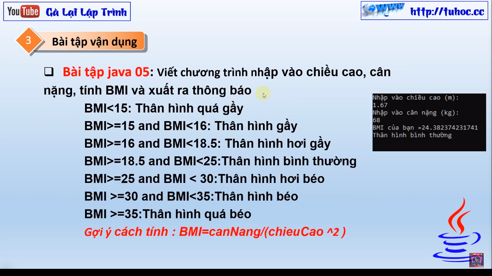
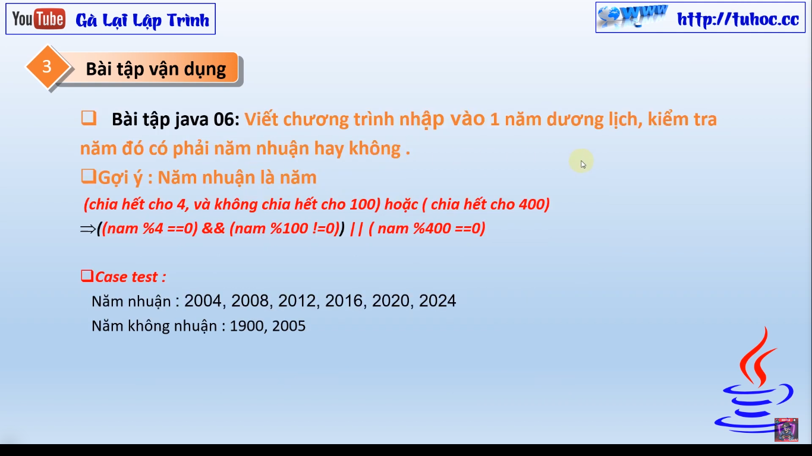
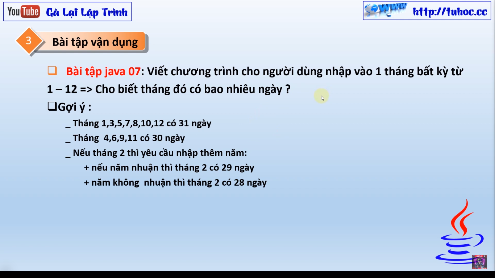
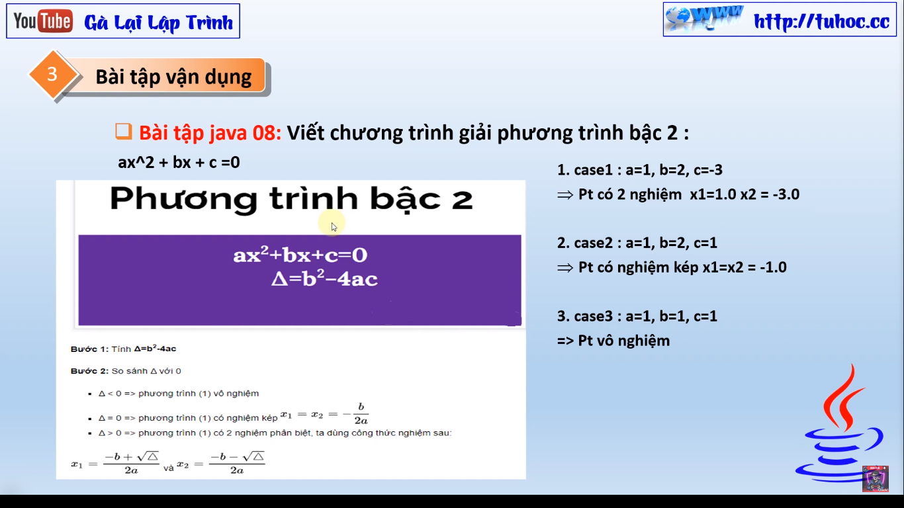
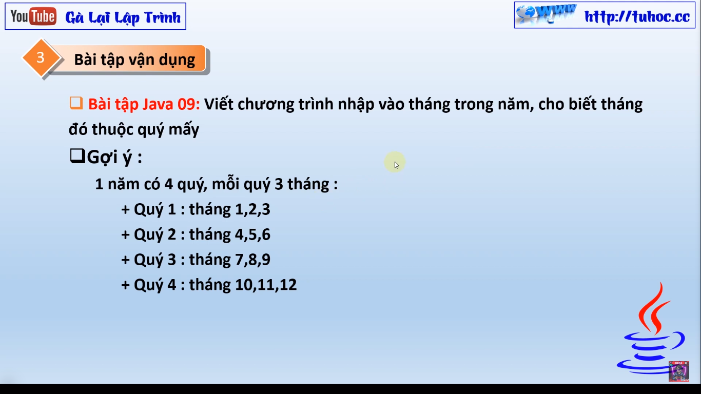

# Bài Giảng: Câu Lệnh If Else trong Java

Đây là bài giảng mới của tôi về câu lệnh if else trong ngôn ngữ lập trình Java. Trong bài giảng này,
tôi sẽ giới thiệu cho các bạn cách sử dụng câu lệnh if else trong Java để điều khiển luồng của
chương trình của bạn. Tôi cũng sẽ giới thiệu một số ví dụ thực tế để giúp các bạn hiểu rõ hơn về
cách sử dụng câu lệnh if else trong Java.
