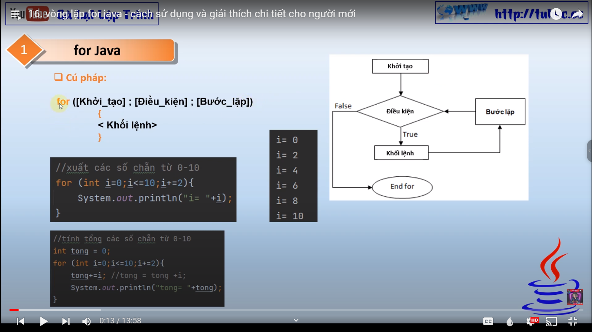

# 16. vòng lặp for java - cách sử dụng và giải thích chi tiết cho người mới

"Chào mừng đến với kênh của tôi! Trong video mới này, tôi sẽ giới thiệu với các bạn về một trong những tính
năng quan trọng trong lập trình Java - vòng lặp for. Tôi sẽ hướng dẫn các bạn cách sử dụng vòng lặp for trong
Java, và giải thích chi tiết các thành phần của nó. Đây là video rất hữu ích cho những người mới bắt đầu học
lập trình Java, vì vòng lặp for là một trong những tính năng cơ bản cần thiết để hiểu rõ hơn về lập trình. Hãy
cùng xem video để tìm hiểu thêm về vòng lặp for trong Java nhé!"

