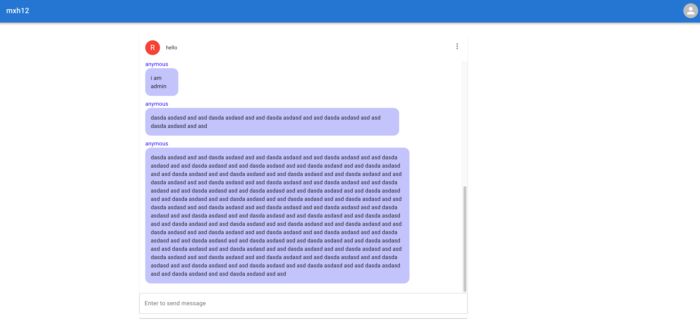

# Project Setup Guide

This guide provides step-by-step instructions to set up and run the backend and frontend for the project.

## Backend Setup

Follow these steps to set up and run the backend server:

### Step 1: Create the MySQL Database

Ensure you have MySQL installed and running. Then, create a new database named `findtheway_db`. You can do this by executing the following command in a MySQL terminal:

```sql
CREATE DATABASE findtheway_db;
```

Alternatively, you can let Spring Boot create the database automatically using the configuration below. Add this to your `application.properties` file:

```properties
spring.datasource.url=jdbc:mysql://localhost:3306/findtheway_db?createDatabaseIfNotExist=true
spring.datasource.username=root
spring.datasource.password=duynghia123
```

My database contains the password: `duynghia123`

### Step 2: Navigate to the Backend Source Code

Open a terminal and navigate to the backend project directory:

```sh
cd path/to/backend
```

### Step 3: Start Redis Server

This project uses Redis for caching. Ensure Redis is installed and running by executing:

```sh
redis-server
```

### Step 4: Run the Backend Server

You can start the backend server using an IDE like IntelliJ IDEA by pressing the **Run** button. Alternatively, use the following command in the terminal:

```sh
mvn spring-boot:run
```

or if using Gradle:

```sh
gradle bootRun
```

## Frontend Setup

Follow these steps to set up and run the frontend:

### Step 1: Navigate to the Frontend Source Code

Open a terminal and navigate to the frontend project directory:

```sh
cd path/to/frontend
```

### Step 2: Install Dependencies

Ensure you have Node.js installed, then install the required dependencies:

```sh
npm install
```

### Step 3: Run the Frontend Application

Start the frontend development server with:

```sh
npm run start
```

This will start the frontend on `http://localhost:3000/` by default.

## Additional Notes

* Ensure MySQL and Redis are running before starting the backend.
* Check for any environment variable requirements and configure them accordingly.
* If you encounter errors, check the logs for debugging.
* If using Docker, consider setting up a `docker-compose.yml` file for easier service management.

For any issues, refer to the project documentation or contact the development team.

---


