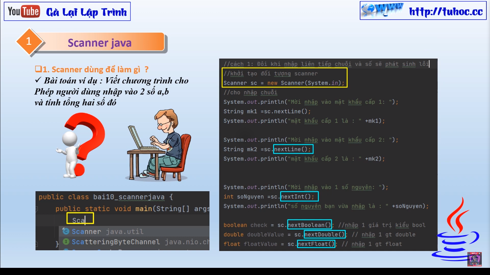
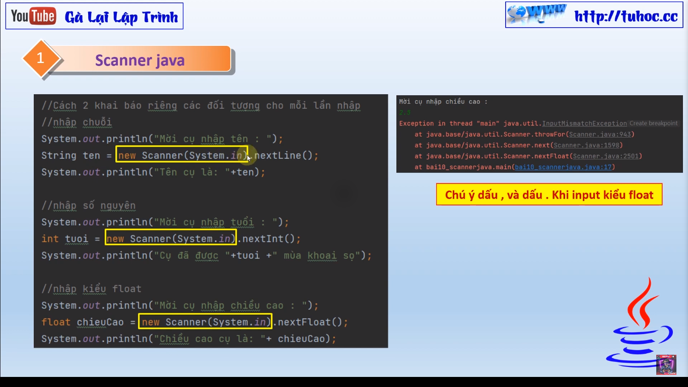
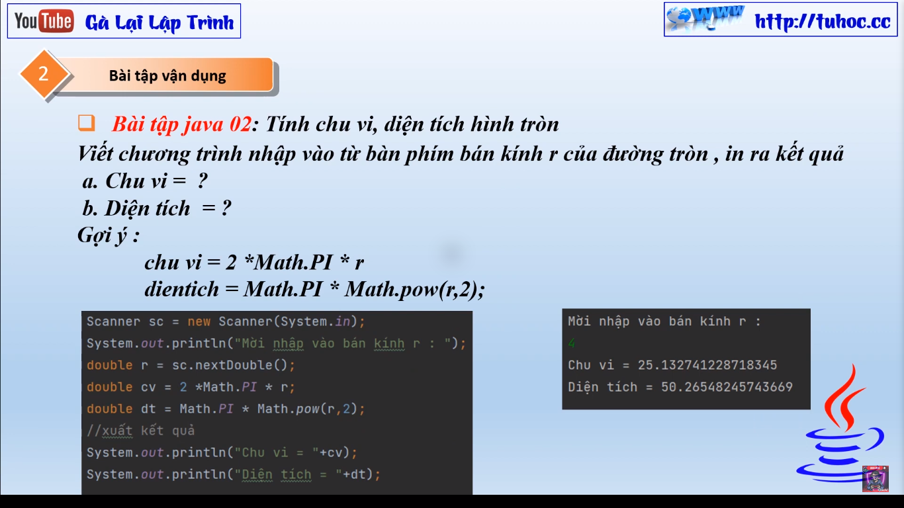
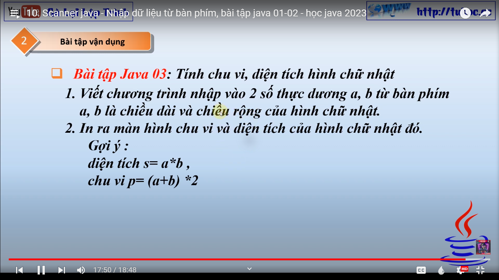

# Giới Thiệu Bài Giảng về Scanner trong Java

Hôm nay tôi sẽ giới thiệu về bài giảng mới của tôi về **Scanner trong Java**. Trong bài học này, chúng ta sẽ tìm hiểu cách sử dụng Scanner để nhập dữ liệu từ bàn phím vào chương trình của chúng ta. Bên cạnh đó, tôi cũng sẽ giới thiệu các **bài tập Java 01 và 02**, trong đó chúng ta sẽ thực hành sử dụng Scanner để xử lý dữ liệu nhập vào từ bàn phím.

Tôi hy vọng rằng bài giảng này sẽ giúp bạn hiểu rõ hơn về cách sử dụng Scanner trong Java và áp dụng nó vào các bài tập thực hành.

Chúc các bạn học tốt!
