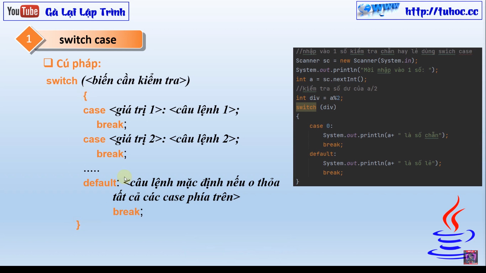
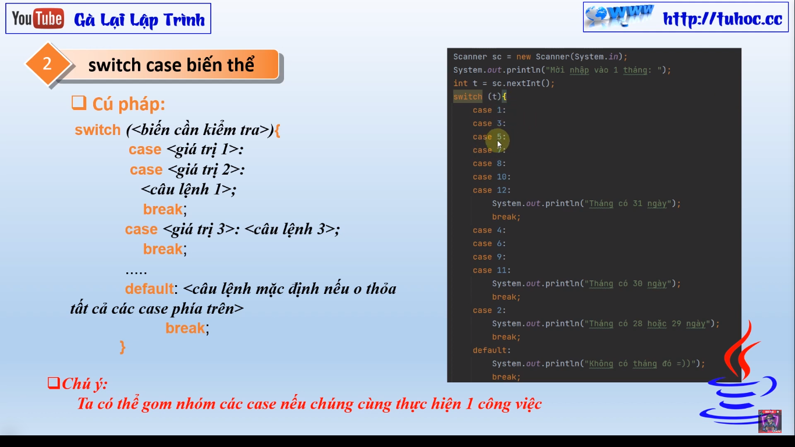
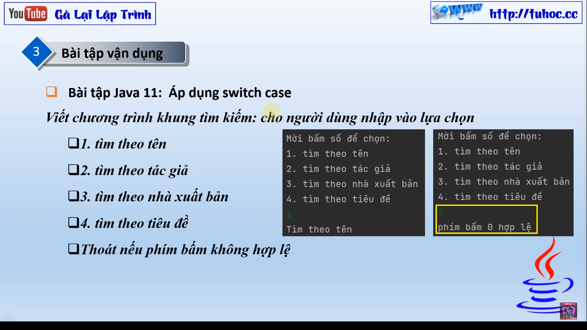

# Bài Giảng: Câu Lệnh Switch Case trong Java

Hôm nay, chúng ta sẽ cùng nhau khám phá một chủ đề mới trong chuỗi bài giảng "Java cơ bản cho người mới" - đó
là câu lệnh switch case trong Java. Câu lệnh này là một công cụ mạnh mẽ trong lập trình, giúp chúng ta thực
hiện lựa chọn dựa trên giá trị của một biến.

## Giới Thiệu

Câu lệnh switch case cho phép chúng ta xử lý nhiều lựa chọn khác nhau dựa trên giá trị cụ thể của một biến. Nó
giúp làm cho mã nguồn trở nên gọn gàng và dễ đọc hơn so với việc sử dụng nhiều câu lệnh if-else lồng nhau.

## Cách Sử Dụng

Cú pháp cơ bản của câu lệnh switch case như sau:

```java
switch(biến){
    case giá_trị_1:
    // Thực hiện các hành động khi biến có giá trị là giá_trị_1
    break;
    case giá_trị_2:
    // Thực hiện các hành động khi biến có giá trị là giá_trị_2
    break;
// Các case khác
default:
    // Thực hiện hành động mặc định nếu không có case nào khớp
    }
```

Lưu ý rằng sau mỗi khối case, chúng ta cần sử dụng break để thoát khỏi switch. Nếu không sử dụng break, các
case phía sau sẽ tiếp tục được thực hiện.

## Quy Tắc Sử Dụng

Mỗi case cần phải kết thúc bằng break để tránh thực hiện các case phía sau.
Thường nên có một khối default để xử lý trường hợp không khớp với bất kỳ case nào.
Ví Dụ Minh Họa
Dưới đây là một ví dụ giản đơn để minh họa cách sử dụng câu lệnh switch case:

```java
int dayOfWeek = 3;

switch(dayOfWeek){
    case 1:
    System.out.

println("Chủ Nhật");
        break;
            case 2:
            System.out.

println("Thứ Hai");
        break;
// Các case khác
default:
    System.out.

println("Ngày không hợp lệ");
}
```
