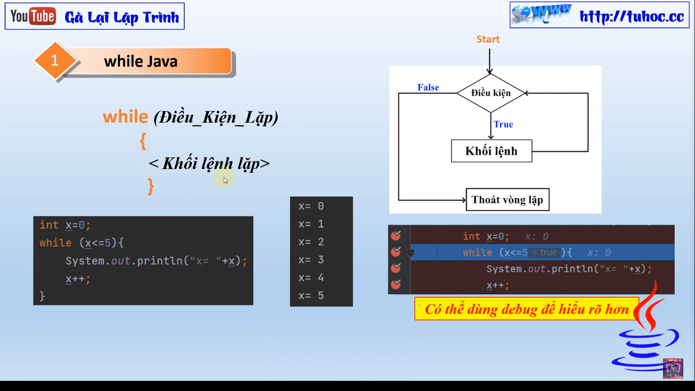
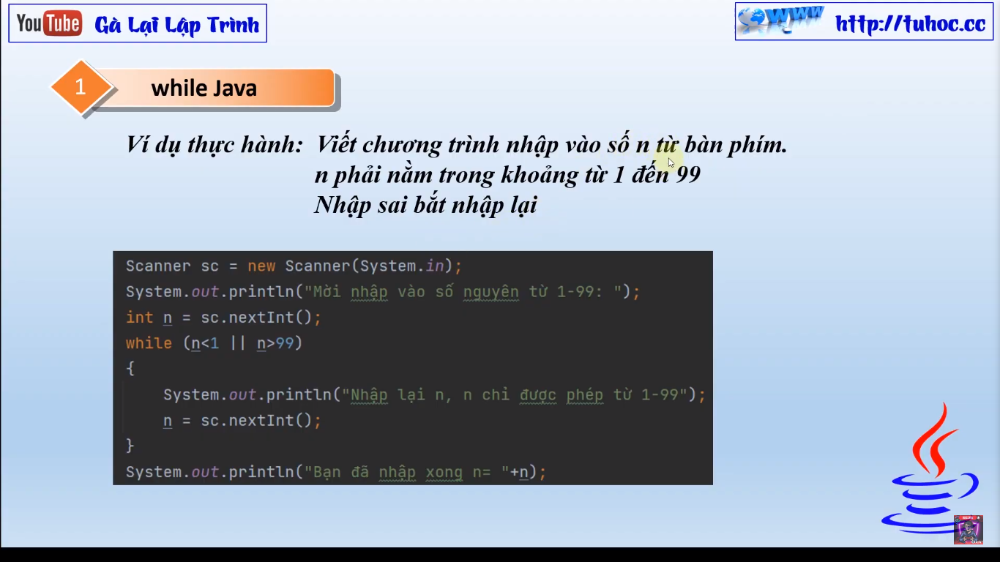

Chào các bạn,
Hôm nay tôi sẽ giới thiệu cho các bạn về vòng lặp while trong ngôn ngữ lập trình Java. Vòng lặp while là một
cấu trúc điều khiển lặp trong Java, cho phép chúng ta lặp lại một đoạn mã nhiều lần cho đến khi điều kiện của
vòng lặp được đáp ứng.

Để sử dụng vòng lặp while, chúng ta cần định nghĩa một điều kiện cho vòng lặp và một đoạn mã sẽ được thực thi
trong vòng lặp. Vòng lặp sẽ tiếp tục chạy cho đến khi điều kiện không được đáp ứng nữa. Đây là một cấu trúc
rất hữu dụng khi chúng ta cần thực thi một đoạn mã nhiều lần và không biết trước số lần cần lặp.

Trong bài giảng này, tôi sẽ hướng dẫn các bạn cách sử dụng vòng lặp while trong Java và các ví dụ minh họa cho
các trường hợp sử dụng thông dụng. Chúng ta cùng bắt đầu ngay hôm nay nhé!
